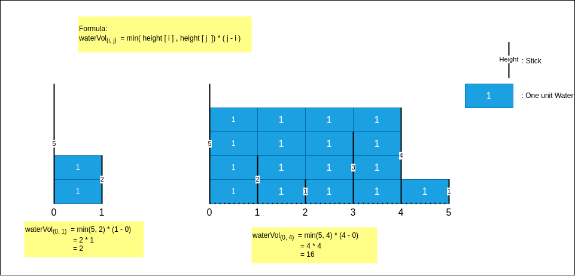

## Links
[Leetcode](https://leetcode.com/problems/container-with-most-water)

## Expected Output


## Approach


### Brute Force
1. Outer loop - left stick
2. Inner loop - right stick
3. Record the water volume for each iteration

T = O(N^2)
S = O(1)
```
class Solution {
    public int maxArea(int[] height) {
        int maxWaterVol = 0;
        int n = height.length;

        for(int i = 0; i < n; i++) {
            for(int j = i + 1; j < n; j++) {
                int currWaterVol = Math.min(height[i], height[j]) * (j - i);
                maxWaterVol = Math.max(maxWaterVol, currWaterVol);
            }
        }
        
        return maxWaterVol;
    }
}
```

### Optimized
**Use Two Pointers**

1. Initial Left stick will be `0` index & Right stick will be `n-1` index
2. Calculate the water volume (currWaterVolume)between these two sticks (refer diagram - to know how)
3. Have a outer variable to store maxWaterVolume for each stick iteration
4. If: `LeftStick_height < RightStick_height` : move to the next stick `i++`
5. If: `RightStick_height < LeftStick_height` : move to the next stick `j--`
6. If `LeftStick_height == RightStick_height` : move both sticks `++i`, `--j`

T = O(N)
S = O(1)
**Approach**
```
class Solution {
    public int maxArea(int[] height) {
        int i = 0;
        int j = height.length - 1;
        int maxWaterVol = 0;

        while(i < j) {
            int currWaterVol = (j - i) * Math.min(height[i], height[j]);
            maxWaterVol = Math.max(maxWaterVol, currWaterVol);

            if(height[i] == height[j]) {
                ++i;
                --j;
            } else if(height[i] < height[j]) {
                ++i;
            } else {
                --j;
            }
        }

        return maxWaterVol;
    }
}
```