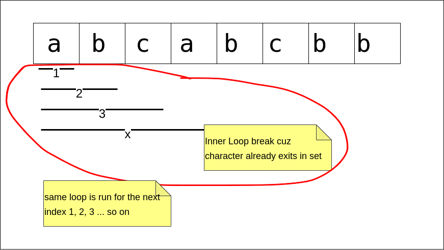

## Links
[Leetcode](https://leetcode.com/problems/longest-substring-without-repeating-characters)

## Expected Output
Length of longest substring without repeating characters

### Brute Force
1. Outer loop `i` is start of window
2. Inner loop `j` is the of the window
3. `j` keeps moving forward & keep adding the element into set as long that element doesnt exist in the
4. If `j` reaches a position where the elements already exist in set then inner loop breaks, window size cannot be increased further, `j` connot move forward.



```
class Solution {
    public int lengthOfLongestSubstring(String s) {
        Set<Character> set = new HashSet<>();

        int n = s.length();
        int start = 0;
        int end = 0;
        int maxWindow = 0;


        for(int i = 0; i < n; i++) {
            set.clear();
            for(int j = i; j < n; j++) {
                if( !set.contains(s.charAt(j))) {
                    set.add(s.charAt(j));
                    maxWindow = Math.max(maxWindow, set.size());
                } else {
                    break;
                }
            }
        }

        return maxWindow;
    }
}
```


### Optimized
**Sliding Window**
1. Two pointers acting as slow & fast pointers
   1. end : check if `char` exist in set, IF-NOT: add it to set
   2. start: check `char` pointed by `end` exists in set
      1. will iteratively remove the remove it is points until the character pointed by `end` becomes doesn't exist in set
2. end => increases the window size
3. start => reduces the window size
4. The gap between end & start is record, the max gap is our result

**Code**
```
class Solution {
    public int lengthOfLongestSubstring(String s) {
        Set<Character> set = new HashSet<>();

        int start = 0;
        int end = 0;
        int maxWindow = 0;

        while( end < s.length() ) {
            if( !set.contains(s.charAt(end))) {
                set.add(s.charAt(end));
                maxWindow = Math.max( maxWindow, end - start + 1);
                ++end;                
            } else {
                set.remove(s.charAt(start));
                ++start;
            }
        }
        
        return maxWindow;
    }
}
```

### Python
**Brute Force**
```
class Solution:
    def lengthOfLongestSubstring(self, s: str) -> int:
        n = len(s)
        l, r = 0, 0
        hset = set()

        maxLen = 0 

        for i in range(n):
            hset.clear()
            for j in range(i, n):
                if s[j] in hset:
                    break
                hset.add(s[j]) 
                maxLen = max(maxLen, len(hset))
        
        return maxLen
```

**Optimized: Two pointer**
```
class Solution:
    def lengthOfLongestSubstring(self, s: str) -> int:
        l = 0
        r = 0
        hset = set()

        maxLen = 0

        while r <len(s):
            if not s[r] in hset:
                hset.add(s[r])
                r += 1
                maxLen = max(maxLen, len(hset))
            else:
                while s[r] in hset:
                    hset.remove(s[l])
                    l += 1
        
        return maxLen
```