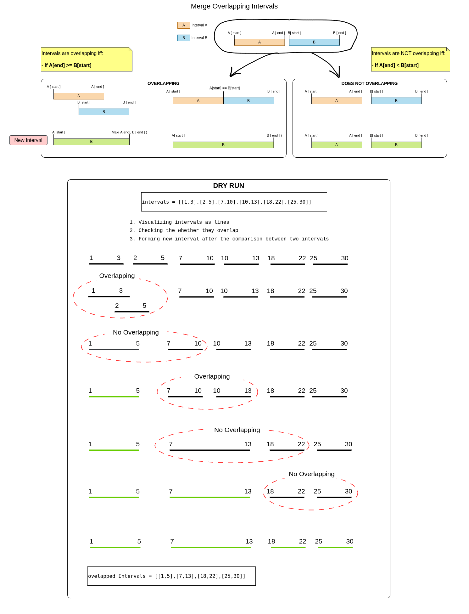

## Links
[Leetcode](https://leetcode.com/problems/merge-intervals/description/)

## Expected Output
List of intervals (overlapping intervals merged into a single interval)

## Approach
> Note: Sort the intervals are based on their `start` value



1. Refer the diagram to understand when two intevals overlap & when they dont
2. Compare two intervals to form new interval

**Code**
```
class Solution {
    public int[][] merge(int[][] intervals) {
       int n = intervals.length;

       if(n == 0 || n == 1) {
           return intervals;
       }

       Arrays.sort(intervals, (a, b) -> a[0] - b[0]);

       List<int[]> res = new ArrayList<>();
       int[] currInterval = intervals[0];
       res.add(currInterval);

       for(int[] newInterval : intervals) {
           if(currInterval[1] >= newInterval[0]) {
               currInterval[1] = Math.max(currInterval[1], newInterval[1]);
           } else {
               currInterval = newInterval;
               res.add(currInterval);
           }
       }

       return res.toArray(new int[res.size()][2]);
    }
}
```