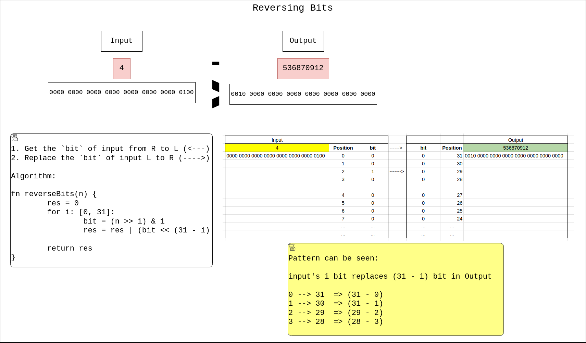

## Links
[Leetcode](https://leetcode.com/problems/reverse-bits/description/)

## Expected Output
Reversed Bits integer

### Brute Force
1. Convert to a string
2. Reverse the string
3. Convert the reversed string to integer

### Optimized

1. Get the `i` (0....31) bit of input
2. Replace the `bit` in `31 - i` bit of output

**Approach**
```
class Solution:
    def reverseBits(self, n: int) -> int:
        res = 0

        for i in range(32):
            bit = (n >> i) & 1
            res = res | (bit << (31 - i))
        
        return res
```