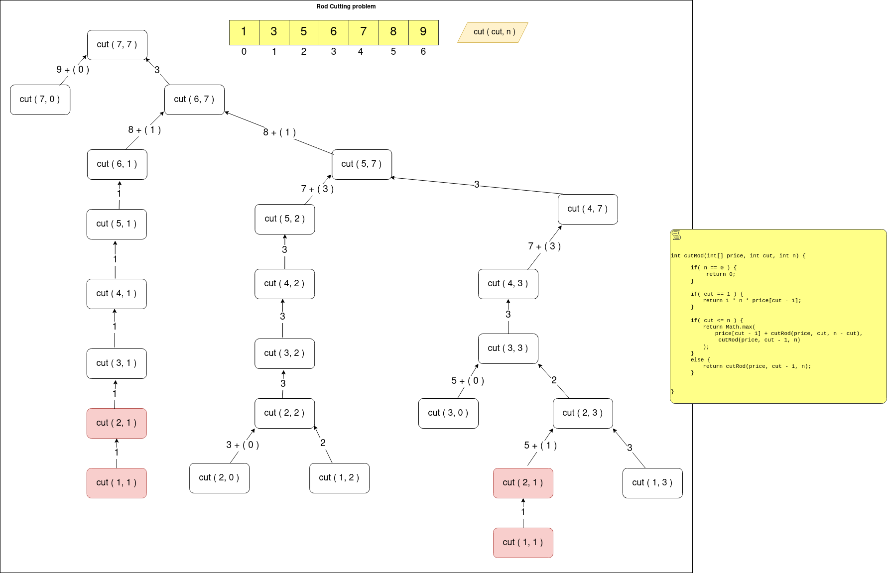

## Links
[GFG](https://practice.geeksforgeeks.org/problems/rod-cutting0840/1)

## Expected Output
Maximum price we can get by cutting certain lengths

## Recursive Approach

## Memoization - Top Down

## Tabulation - Bottom Up

**NOTE:**
1. Draw Recursive Tree with N >= 6, to show the subproblem



**Recursive**
```
class Solution{
    
    private int cutRod(int[] price, int cut, int n) {
        if( n == 0 ) {
            return 0;
        }
        
        if( cut == 1 ) {
            return 1 * n * price[cut - 1];
        }
        
        if( cut <= n ) {
            return Math.max(
                    price[cut - 1] + cutRod(price, cut, n - cut),
                    cutRod(price, cut - 1, n)
                );
        } else {
            return cutRod(price, cut - 1, n);
        }
    }
    
    public int cutRod(int price[], int n) {
        return cutRod(price, n, n);
    }
}
```

**Memoization - Top Down**
```
class Solution{
    
    private int cutRod(int[] price, int cut, int n, int[][] dp) {
        if( n == 0 ) {
            return 0;
        }
        
        if( cut == 1 ) {
            return 1 * n * price[cut - 1];
        }
        
        if( dp[cut][n] != -1 ) {
            return dp[cut][n];
        }
        
        if( cut <= n ) {
            return dp[cut][n] = Math.max(
                    price[cut - 1] + cutRod(price, cut, n - cut, dp),
                    cutRod(price, cut - 1, n, dp)
                );
        } else {
            return dp[cut][n] = cutRod(price, cut - 1, n, dp);
        }
    }
    
    public int cutRod(int price[], int n) {
        int[][] dp = new int[n + 1][n + 1];
        
        for(int[] arr: dp) {
            Arrays.fill(arr, -1);
        }
        
        return cutRod(price, n, n, dp);
    }
}
```

**Tabulation - Bottom Up**
```
class Solution {

    public int cutRod(int price[], int n) {
        int[][] dp = new int[n + 1][n + 1];
        
        for(int i = 0; i < n + 1; i++) {
            dp[0][i] = 0;
        }
        
        for(int i = 1; i < n + 1; i++) {
            dp[i][0] = price[i - 1];
        }
        
        /**
        * Memoized Code reference 
        * n   => i
        * cut => j
        **/
        for(int i = 1; i < n + 1; i++) {
            for(int j = 1; j < n + 1; j++) {
                if(j <= i) {
                    dp[i][j] = Math.max( price[j - 1] + dp[i- j][j], dp[i][j - 1]); 
                } else {
                    dp[i][j] = dp[i][j - 1];
                }
            }
        }
        
        return dp[n][n];
    }
}
```


## Python:

**Brute Force:**
```
class Solution:
    def cutRod(self, price, n):
        def dfs(rod_len):
            if rod_len == 0:
                return 0
                 
            max_price = float('-inf')
            
            for cut_len in range(1, rod_len + 1):
                cut_price = price[cut_len - 1] + dfs(rod_len - cut_len)
                max_price = max(max_price, cut_price)
            
            return max_price
        
        return dfs(n)
        
```

**Memoization:**
```
class Solution:
    def cutRod(self, price, n):
        dp = {}
        def dfs(n):
            if n == 0:
                return 0
            
            if n in dp:
                return dp[n]
            
            max_price = float('-inf')
            
            for i in range(1, n + 1):
                cut_price = price[i - 1] + dfs(n - i)
                max_price = max(max_price, cut_price)
            
            dp[n] = max_price
            return dp[n]
        
        return dfs(n)
```

**DP:**
```
class Solution:
    def cutRod(self, price, n):
        dp = [0] * (n + 1)
    
        for rod_len in range(1, n + 1):
            profit = 0
            for cut_len in range(1, rod_len + 1):
                profit = max(profit, price[cut_len - 1] + dp[rod_len - cut_len])
            dp[rod_len] = profit
        
        return dp[n]
```