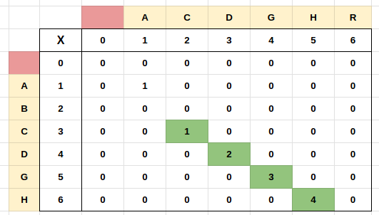

## Links
[GFG](https://practice.geeksforgeeks.org/problems/longest-common-substring1452/1)

## Expected Output
**Length** of Longest Common Substring between two Strings

## Recursive Approach

## Tabulation - Bottom Up


**Recursive**
```
class Solution{
    int max(int x, int y, int z) {
        return Math.max(x, Math.max(y, z));
    }
    
    int longestCommonSubstr(String s1, String s2, int n, int m, int count) {
        if(n == 0 || m == 0) {
            return count;
        }
        
        if( s1.charAt(n -1) == s2.charAt(m - 1)) {
            count = longestCommonSubstr(s1, s2, n - 1, m - 1, count + 1);
        }
        
        int freduce = longestCommonSubstr(s1, s2, n - 1, m);
        int sreduce = longestCommonSubstr(s1, s2, n, m - 1);
        
        return max(count, freduce, sreduce);
    }
    
    int longestCommonSubstr(String S1, String S2, int n, int m){
        return longestCommonSubstr(S1, S2, n, m, 0);
    }
}
```

**Tabulation - Bottom Up**
```
class Solution{

    int longestCommonSubstr(String S1, String S2, int n, int m){

        int[][] dp = new int[n+1][m+1];
        int max = 0;
        
        for(int i = 0; i < m+1; i++) {
            dp[0][i] = 0;
        }
        
        for(int i = 0; i < n+1; i++) {
            dp[i][0] = 0;
        }
        
        for(int i = 1; i < n+1; i++) {
            for(int j = 1; j < m+1; j++) {
                if( S1.charAt(i - 1) == S2.charAt(j - 1) ) {
                    dp[i][j] = dp[i - 1][j - 1] + 1;
                    max = Math.max(max, dp[i][j]);
                } 
                else {
                    dp[i][j] = 0;
                }
            }
        }

        return max;
    }
}
```