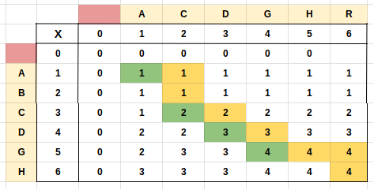

## Links
[Leetcode](https://leetcode.com/problems/longest-common-subsequence/)
[GFG](https://practice.geeksforgeeks.org/problems/longest-common-subsequence-1587115620/1)

> This Question is an extension of Length of LCS

## Expected Output
Print the Longest Common Subsequence String

## Approach - Tabulation
1. Get LCS Array
2. Getting the string is described in code



**Tabulation - Bottom Up**
```
class Solution
{
    private static int[][] _lcs(int x, int y, String s1, String s2) {
        int[][] dp = new int[x + 1][y + 1];
        
        
        for(int i = 1; i < x + 1; i++) {
            for(int j = 1; j < y + 1; j++) {
                if(s1.charAt(i - 1) == s2.charAt(j - 1)) {
                    dp[i][j] = 1 + dp[i - 1][j - 1];
                } else {
                    dp[i][j] = Math.max( dp[i - 1][j], dp[i][j - 1]);
                }
            }
        }
        
        return dp;
    }

    static int lcs(int x, int y, String s1, String s2)
    {
        int[][] dp = _lcs(x, y, s1, s2);
        
        int i = x;
        int j = y;
        String res = "";
        
        while( i > 0 && j > 0 ) {
            if(s1.charAt(i - 1) == s2.charAt(j - 1)) {
                res = s1.charAt(i - 1) + res;
                --i;
                --j;
            } else {
                if(dp[i][j - 1] > dp[i - 1][j]) {
                    --j;
                } else {
                    --i;
                }
            }
        }
        
        System.out.println(res);
        
        return dp[x][y];
    }
}
```