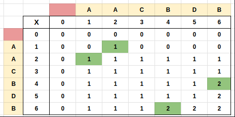

## Links
[GFG](https://practice.geeksforgeeks.org/problems/longest-repeating-subsequence2004/1)

## Expected Output
Longest repeating subsequence


## Approach
1. Modified - LCS
   1. lcs(str, str)
   2. str(i - 1) == str(j - 1) && i != j

## Questions
1. Why did you add extra `i != j` check
   1. To mark those characters which have a duplicate in the same string. There are two ways in which `str(i - 1) == str(j - 1)`
      1. When i == j (i & j pointing to same cell)
      2. When i != j (i & j pointing to different cell)
      3. Record all such duplicates additively & return the final count of repeating characters

**Tabulation - Bottom Up**
```
class Solution
{
    public int LongestRepeatingSubsequence(String str)
    {
        int n = str.length();
        
        int[][] dp = new int[n + 1][n + 1];
        
        for(int i = 1; i < n + 1; i++) {
            for(int j = 1; j < n + 1; j++) {
                if( str.charAt(i - 1) == str.charAt(j - 1) && i != j) {
                    dp[i][j] = 1 + dp[i - 1][j - 1];
                } else {
                    dp[i][j] = Math.max(dp[i - 1][j], dp[i][j - 1]);
                }
            }
        }
        
        return dp[n][n];
    }
}
```