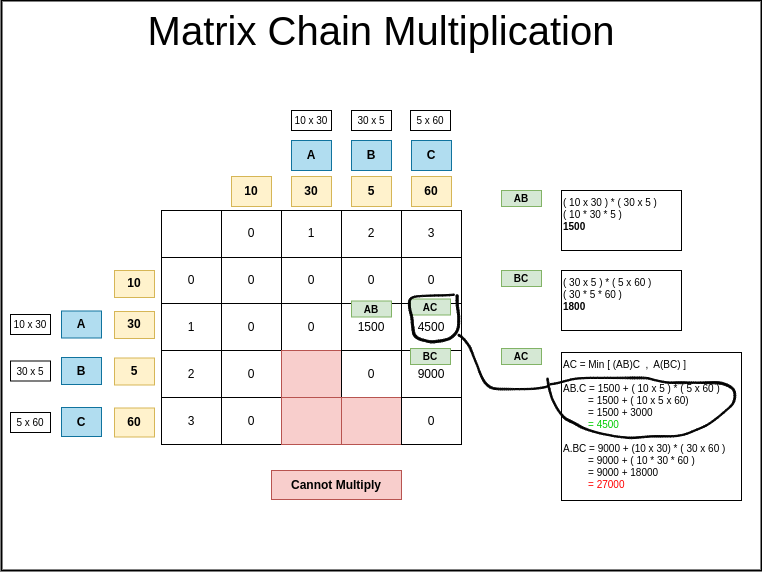

## Links
[GFG](https://practice.geeksforgeeks.org/problems/matrix-chain-multiplication0303/1)

## Expected Output


## Recursive Approach

```
class Solution{
    
    static int mcm(int[] arr, int i, int j) {
        if( i >= j ) {
            return 0;
        }
        
        int minOps = Integer.MAX_VALUE;
        
        for(int k = i; k <= j - 1; k++) {
            int ops = mcm(arr, i, k) + mcm(arr, k + 1, j) + arr[i - 1] * arr[k] * arr[j];
            minOps = Math.min(minOps, ops);
        }
        
        return minOps;
    }
    static int matrixMultiplication(int N, int arr[])
    {
        return mcm(arr, 1, N - 1);
    }
}
```

## Memoization - Top Down

>NOTE: The first cell to be calcuated is dp[1][N - 1], since it's memoization  dp[1][N - 2] & dp[2][N - 1] cells need to recursively calculated whose values get added into dp[1][N - 1], same logic applies to tabulation

```
class Solution{
    
    static int mcm(int[] arr, int i, int j, int[][] dp) {
        if( i >= j ) {
            return dp[i][j] = 0;
        }
        
        if( dp[i][j] != -1 ) {
            return dp[i][j];
        }
        
        int minOps = Integer.MAX_VALUE;
        
        
        for(int k = i; k <= j - 1; k++) {
            int ops = mcm(arr, i, k, dp) + mcm(arr, k + 1, j, dp) + arr[i - 1] * arr[k] * arr[j];
            minOps = Math.min(minOps, ops);
        }
        
        return dp[i][j] = minOps;
    }
    static int matrixMultiplication(int N, int arr[])
    {
        int[][] dp = new int[N][N];
        
        for(int[] t: dp) {
            Arrays.fill(t, -1);
        }
        
        return mcm(arr, 1, N - 1, dp);
    }
}
```

## Tabulation - Bottom Up

1. All computation are upper diagonal area
2. Start at cell immediately after the diagonal
   1. all below diagonal are invalid ( cannot be multiplied)
3. Cell value logic is same as the memoization logic

>NOTE: Bottom up, the calculation is made from dp[n-1][n-1] to dp[0][0] & every cell adjacent to diagonal line is calculated & it's result is needed to the right cell beside it. Every cell needs the calculation of cell to left & below it.
```
class Solution{
    
    static int matrixMultiplication(int N, int arr[]) {
        int[][] dp = new int[N][N];
        
        for(int i = N - 1; i >= 1; i--) {
            for(int j = i + 1; j < N; j++) {
                
                int minOps = Integer.MAX_VALUE;
                
                for(int k = i; k <= j - 1; k++) {
                    int ops = arr[i - 1] * arr[k] * arr[j] 
                                + dp[i][k]
                                + dp[k + 1][j];
                    minOps = Math.min(ops, minOps);
                }
                
                dp[i][j] = minOps;
            }
        }
        
        for(int[] t : dp) {
            for(int x : t) {
                System.out.print(x+"  ");
            }
            System.out.println("");
        }
        
        return dp[1][N - 1];
    }
}
```

## Python

**Recursion:**
```
class Solution:
    def mcm(self, i, j, arr):
        if i == j:
            return 0
        
        minOps = float('inf')
        
        for k in range(i, j):
            leftCost = self.mcm(i, k, arr)
            rightCost = self.mcm(k + 1, j, arr)
            mergeCost = arr[i - 1] * arr[k] * arr[j]
            
            minOps = min(minOps, leftCost + rightCost + mergeCost)
        
        return minOps
        
    def matrixMultiplication(self, N, arr):
        return self.mcm(1, N - 1, arr)
```

**Memoization:**
```
class Solution:
    def mcm(self, i, j, arr, dp):
        if i == j:
            return 0
        
        if (i, j) in dp:
            return dp[(i, j)]
        
        minOps = float('inf')
        
        for k in range(i, j):
            leftCost = self.mcm(i, k, arr, dp)
            rightCost = self.mcm(k + 1, j, arr, dp)
            mergeCost = arr[i - 1] * arr[k] * arr[j]
            
            minOps = min(minOps, leftCost + rightCost + mergeCost)
        
        dp[(i, j)] = minOps
        
        return dp[(i, j)]
        
    def matrixMultiplication(self, N, arr):
        dp = {}
        return self.mcm(1, N - 1, arr, dp)
```

**Tabulation:**

```

```

**Where you can go wrong:**
1. Looping 
```
for k in range(i, j):
```
- `i` start with `1` (first invocation of mcm())

2. Partiton `k` loops from `i` to `j` -> [i, j - 1]

3. Merge cost 
`mergeCost = arr[i - 1] * arr[k] * arr[j]`
    - `arr[i - 1]` ( I coded as `arr[k - 1]`)

