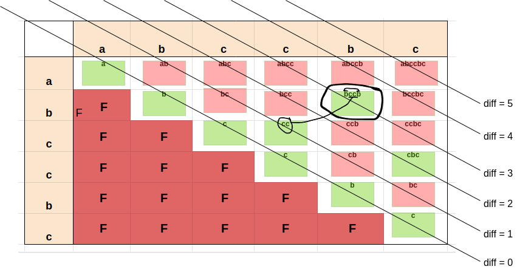

## Links
[Leetcode](https://leetcode.com/problems/longest-palindromic-substring/description/)

## Expected Output
Longest Palindrome - substring

## Brute Force
Sliding Window Approach
len - Window length
i - max value of start pointer
end-pointer - n - len

```
class Solution {

    private boolean isPalindrome(String str, int i, int j) {
        j = j - 1;

        while(i < j) {
            if(str.charAt(i) != str.charAt(j)) {
                return false;
            }
            ++i;
            --j;
        }

        return true;
    }
    public String longestPalindrome(String s) {
        int n = s.length();
        
        for(int i = 0; i < n; i++) {
            for(int j = n - i; j <= n; j++) {
                if(isPalindrome(s, i, j)) {
                    return s.substring(i, j);
                }
            }
        }

        return "";
    }
}
```
## Tabulation - Bottom Up
1. If the string be partitioned into n(n+1) substrings, the the palidromic logic can be reduced to a sub-problem
2. `baab` -> just compare b & b elements in the middle can be solved using dp in a bottom up way
3. 


**Tabulation - Bottom Up**
```
class Solution {
    public String longestPalindrome(String s) {
        int n = s.length();
        boolean[][] dp = new boolean[n][n];
        int[] res = new int[2];

        // 0: 00 11 22 33 44 55 (6) - Indepedendent of previous diagonal
        for(int i = 0; i < n; i++) {
            dp[i][i] = true;
        }

        // 1: 01 12 23 34 45 - Indepedendent of previous diagonal 
        for(int i = 0; i < n - 1; i++) {
            if(s.charAt(i) == s.charAt(i + 1)) {
                dp[i][i + 1] = true;
                res[0] = i;
                res[1] = i + 1;
            }
        }

        // 2: 02 13 24 35 - Dependent of previous diagonal
        // 3: 03 14 25
        // 4: 04 15
        // 5: 05
        for(int diff = 2; diff < n; diff++) {
            for(int i = 0; i < n - diff; i++) {
                int j = i + diff;
                if(s.charAt(i) == s.charAt(j) && dp[i+1][j-1]) {
                    dp[i][j] = true;
                    res[0] = i;
                    res[1] = j;
                }
            }
        }

        int i = res[0];
        int j = res[1];

        return s.substring(i, j + 1);
    }
}
```

`Find a way to bottom-up build the logic of Palindrome`

## Approach 2: Left & Right Pointer

```
class Solution:
    def longestPalindrome(self, s: str) -> str:
        n = len(s)

        def findPalindrome(i, j):
            while i >= 0 and j < n and s[i] == s[j]:
                i -= 1
                j += 1
            
            return s[i+1:j]
        
        res = ''
        for i in range(n):
            odd_palin = findPalindrome(i, i)
            even_palin = findPalindrome(i, i + 1)

            res_len = len(res)

            if len(odd_palin) > res_len:
                res = odd_palin
                
            if len(even_palin) > res_len:
                res = even_palin
            
        return res
```