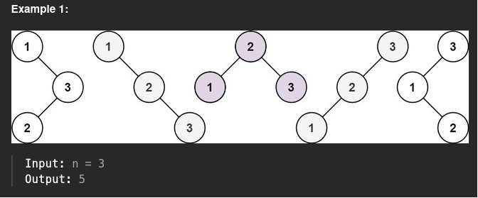

## links
[leetcode](https://leetcode.com/problems/unique-binary-search-trees)

## Expected Output
Number of unique BST



## Recursive Approach

```
class Solution:
    def numTrees(self, n: int) -> int:
        if n <= 1:
            return 1
        
        total = 0

        for i in range(1, n + 1):
            left = self.numTrees(i - 1, dp)
            right = self.numTrees(n - i, dp)

            total += (left * right)
        
        return total
```

## Memoization - Top_Down

```
class Solution:
    def helper(self, n: int, dp: List[List[int]]) -> int:
        if n <= 1:
            return 1
        
        if n in dp:
            return dp[n]
        
        total = 0

        for i in range(1, n + 1):
            left = self.helper(i - 1, dp)
            right = self.helper(n - i, dp)

            total += (left * right)
        
        dp[n] = total

        return total

    def numTrees(self, n: int) -> int:
        dp = {}
        return self.helper(n, dp)
```

## Tabulation - Bottom up

```
class Solution:
    def numTrees(self, n: int) -> int:
        dp = [0] * (n + 1) 

        dp[0] = 1

        for i in range(1, n + 1):
            res = 0
            for j in range(i):
                left = dp[j]
                right = dp[i - 1 - j]
                res += (left * right)
            
            dp[i] = res
        
        return dp[n]
```

**Questions**:
1. Why `n==0` -> `result = 1`
2. Why `left * right` =>


