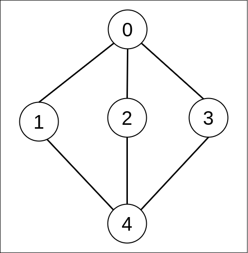

## Links
[GFG](https://practice.geeksforgeeks.org/problems/bfs-traversal-of-graph/1)

## Expected Output

## Approach
1. Put the Node into the queue & Mark it as visted
   1. Get it's adjacency list nodes & repeat (1)
2. Before adding a node into queue check if it's already visted, Add into queue - iff the node is unvisted

**Dry Run**:


>NOTE: Visualize: using Queue + Visited Array
> A node is visited the very moment it's added onto the Queue

**Approach - Adjacency List**
```
class Solution {
    // Function to return Breadth First Traversal of given graph.
    public ArrayList<Integer> bfsOfGraph(int V, ArrayList<ArrayList<Integer>> adj) {

        boolean[] visited = new boolean[V];
        ArrayList<Integer> res = new ArrayList<>();
        
        Queue<Integer> q = new LinkedList<>();
        q.add(0);
        visited[0] = true;
        
        while( !q.isEmpty() ) {
            int node = q.poll();
            res.add(node);
            
            for(int x : adj.get(node) ) {
                if( !visited[x] ) {
                    visited[x] = true;
                    q.add(x);
                }
            }
        }
        
        return res;
    }
}
```


**Approach - Adjacency Matrix**
```
    // node = 0
    void bfs(int node, int[][] matrix, boolean[] visited) {
        Queue<Integer> q = new LinkedList<>();
        q.offer(node);
        visited[node] = true;

        while (!q.isEmpty()) {
            node = q.poll();

            for (int i = 0; i < matrix.length; i++) {
                
                if (matrix[node][i] == 1 && !visited[i]) {
                    q.offer(i);
                    visited[i] = true;
                }
            }
        }
    }
```

**Python**
```
from typing import List
import collections

class Solution:
    #Function to return Breadth First Traversal of given graph.
    def bfsOfGraph(self, V: int, adj: List[List[int]]) -> List[int]:
        visited = [False] * V
        q = collections.deque()
        
        res = []
        
        q.append(0)
        visited[0] = True
        
        while q:
            node = q.popleft()
            res.append(node)
            
            for nb in adj[node]:
                if not visited[nb]:
                    visited[nb] = True
                    q.append(nb)
        
        return res
```