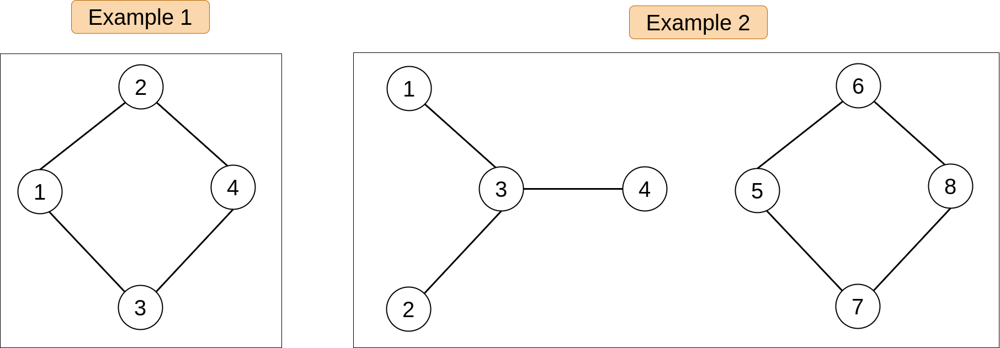

## Links
[GFG](https://practice.geeksforgeeks.org/problems/detect-cycle-in-an-undirected-graph/1)

## Expected Output
True: Cycle detected
False: Cycle Not detected

## Approach
1. Modified Disconnected Component 
2. DFS Traversal 
3. Neighbour-Source checker


**Dry Run:**
1. Tri
2. Quad
3. Disconnected Graph

**Edge Case:**
1. Disconnected Component
 
**NOTE:**
A neighbour-node is visted IFF: That Neighbour-node is the source of my current node
```
if ( !visited[nb] ) {
  // 1. Mark as visited
  // 2. Record the parent of neighbour-node
  // 3. Insert into Queue
} else if( !(parent[currentNode] == nb) ) {
  // Cycle Detected
}
```

**NOTE:**
> Code acts differently w.r.t `&&` and `Nested Loop`\
> && : Fails Test Cases\
> Nested Loop : Passes Test Cases\
> Recommeded: Use Nested Loop incase you're logic fails and try

_**Passes**_:
```
if( !visited[nb] ) { 
    if( detectCycle(nb, currNode, adj, visited) ) {
        return true;
    }
}
```

_**Fails**_:
```
if( !visited[nb] && detectCycle(nb, currNode, adj, visited)) { 
    return true;
}
```
**Approach**
```
class Solution {
    
    private boolean detectCycle(int currNode, int src, ArrayList<ArrayList<Integer>> adj, boolean[] visited) {
        visited[currNode] = true;
        
        for(int nb : adj.get(currNode)) {
            if( !visited[nb] ) { 
                if( detectCycle(nb, currNode, adj, visited) ) {
                    return true;
                }
            } else if( nb != src) {
                return true;                
            }
        }
        return false;
    }
    
    public boolean isCycle(int V, ArrayList<ArrayList<Integer>> adj) {
        boolean[] visited = new boolean[V];
        int[] parent = new int[V];
        
        for(int i = 0; i < V; i++) {
            if( !visited[i] && detectCycle(i, -1, adj, visited) ) {
                return true;
            }
        }
        
        return false;
    }
}
```


Idea:
   - If a node has a neighbouring node that is visited & not the source of currentNode then it is a cycle.
- You cannot have a visited node as a neighbour unless it is your source node