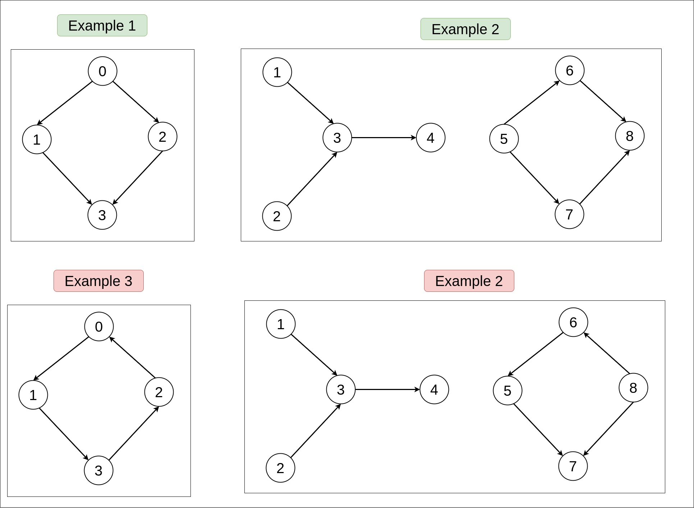
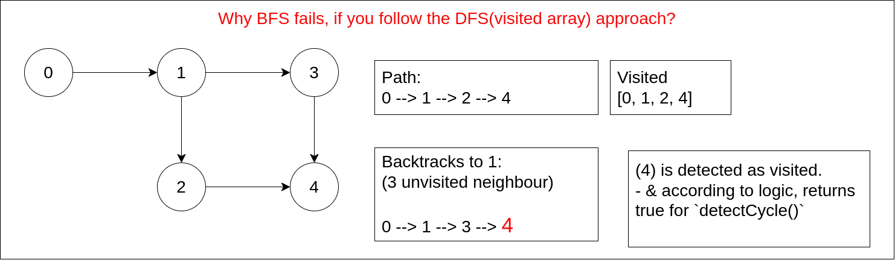

## Links
[GFG]()
[coding_ninjas](https://www.codingninjas.com/codestudio/problems/1062626)

## Expected Output

## Approach
- Topological sort can only be done on DAGs(Directed Acyclic Graph) which will return same nodes in sorted order.
- If a graph contains cycle:
  1. It is not a DAG
  2. It cannot return same number of topologically sorted array of nodes

1. Apply Kahn Algorithm to get topologically sorted Array
   1. If graph has a cycle : topologically sorted Array `is not equal`  total number of nodes
   2. If graph doesnt have a cycle : topologically sorted Array `equal` total number of nodes

**dry run**


**Approach**
```
public class Solution {
  public static boolean detectCycleInDirectedGraph(int n, ArrayList < ArrayList < Integer >> edges) {
    List<List<Integer>> adj = new ArrayList<>();
    
    for(int i = 0; i <= n; i++) {
      adj.add(new ArrayList<>());
    }

    for(ArrayList<Integer> li : edges ) {
      int u = li.get(0);
      int v = li.get(1);

      adj.get(u).add(v);
    }

    //indegree node
    int[] indegree = new int[n + 1];
    
    for(List<Integer> li : adj) {
      for(int nb : li) {
        indegree[nb] += 1;
      }
    }

    // 
    Queue<Integer> q = new LinkedList<>();
    List<Integer> res = new ArrayList<>();

    for(int i = 1; i <= n; i++) {
      if( indegree[i] == 0 ) {
        q.add(i);
      }
    }

    while( !q.isEmpty() ) {
      int currNode = q.poll();
      res.add(currNode);

      for(int nb : adj.get(currNode)) {
        indegree[nb] -= 1;
        
        if( indegree[nb] == 0 ) {
          q.add(nb);
        }
      }
    }
    
    if( res.size() == n ) {
      return false;
    }

    return true;
  }
}
```

### Questions
1. Why cant you use a similar approach as you did in DFS?
- e.g.:


Image is descriptory.

Why the normal BFS approach fails?
- A single node has multiple parent nodes, if via any one parent's path we reach a child node, when we traverse via
another parent the `visted` array marks `child` as visited (which is correct) but it is visited for that parent's path
& not current parents path.

Solution:
Approach 1:
- Tracking the parents, & making them visted based on parent 

Approach 2:
- simplified approach 1, keep a track of `indegrees` & reduce it as you visit a node, if at any node, you have `indegree[node] == 0 && visted == true`, then you can
say cycle is visited.