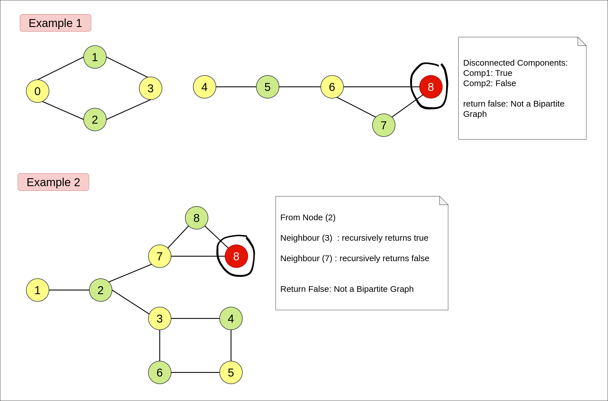

## Links
[Leetcode](https://leetcode.com/problems/is-graph-bipartite/description/)

## Expected Output
True: Graph is Bipartite
False: Graph is Not Bipartite

## Approach
1. Use a color[] to note the color of each node
2. If Node color is `0` none of it's neighbour must have color `1`,
   1. If a neighbour has color `0` it's not a bipartite graph
```
if( color[currNode] == color[neighbour] ) {
    return false; // not a bipartite graph
}
```



**Approach**
```
class Solution {

    private boolean checkDfs(int currNode, int pColor, int[] color, int[][] graph) {
        color[currNode] = pColor; 

        for(int neighbour : graph[currNode]) {
            if( color[neighbour] == -1 ) {
                if( !checkDfs(neighbour, 1 - color[currNode], color, graph) ) {
                    return false;
                }
            } else if( color[neighbour] == color[currNode]) {
                return false;
            }
        }

        return true;
    }

    public boolean isBipartite(int[][] graph) {
        int v = graph.length;
        int[] color = new int[v];

        Arrays.fill(color, - 1);

        for(int i = 0; i < v; i++) {
            if( color[i] == -1 ) {
                if( !checkDfs(i, 0, color, graph) ) {
                    return false;
                }
            }
        }

        return true;
    }
}
```