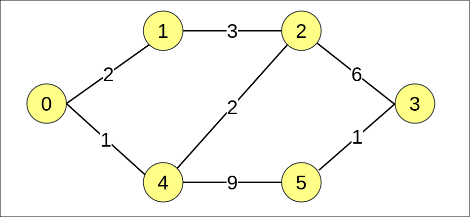

## Links
[GFG](https://practice.geeksforgeeks.org/problems/shortest-path-in-undirected-graph/1)

## Expected Output
Array of shortest Paths from source-node to all nodes

## Approach - Dijkstra's Algorithm
1. Same as `Shortest Path in DAG using Queue`, here instead of `Queue` we use `PriorityQueue`
2. `PriorityQueue` removes the `node` with shortest Path from the current node - we follow that path to track the distance

**dry run**


**Approach**
```
PriorityQueue<Pair> pq = new PriorityQueue<>( (v1, v2) -> v1.wt - v2.wt );

- .wt is a field of class Pair
- min-heap is decided polls that queue with smallest distance
```

```
class Solution {

    class Pair {
        int vertex;
        int wt;
        
        Pair(int _v, int _wt) {
            vertex = _v;
            wt = _wt;
        }
    }
    
    private int[] dijkstra(int src, int N, List<List<Pair>> adjList) {
        int[] dist = new int[N];
        PriorityQueue<Pair> pq = new PriorityQueue<>( (v1, v2) -> v1.wt - v2.wt );
        
        for(int i = 0; i < N; i++) {
            dist[i] = Integer.MAX_VALUE;
        }
        dist[src] = 0;
        pq.add(new Pair(src, 0));
        
        while( !pq.isEmpty() ) {
            Pair u = pq.poll();
            
            for(Pair nb : adjList.get(u.vertex)) {
                if( dist[u.vertex] + nb.wt < dist[nb.vertex]) {
                    dist[nb.vertex] = dist[u.vertex] + nb.wt;
                    pq.add(new Pair(nb.vertex, dist[nb.vertex]));
                }
            }
        }
        
        return dist;
    }

	public int[] shortestPath(int N,int M, int[][] edges) {
		List<List<Pair>> adjList = new ArrayList<>();
		
		// Create a empty structure to hold data
		for(int i = 0; i < N; i++) {
		    adjList.add(new ArrayList<>());
		}
		
		// Create Adjacency List
		for(int[] edge : edges) {
		    adjList.get(edge[0]).add(new Pair(edge[1], edge[2]));
		}
		
// 		for(int i = 0; i < N; i++) {
// 		    System.out.print(i+": ");
// 		    for(Pair u : adjList.get(i)) {
// 		        System.out.print("[ "+u.v+" "+u.wt+"] ");
// 		    }
// 		    System.out.println();
// 		}
		
		int dist[] = dijkstra(0, N, adjList);
		
		for(int i = 0; i < N; i++) {
		    if(dist[i] == Integer.MAX_VALUE) {
		        dist[i] = -1;
		    }
		}
		
		return dist;
	}
}
```