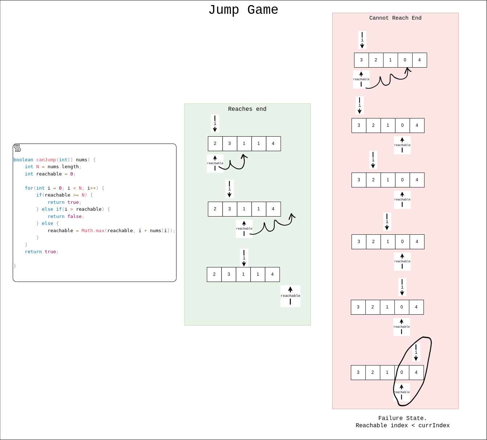

## Links
[Leetcode](https://leetcode.com/problems/jump-game/description/)

## Expected Output
Goal: To reach last index from first index
`true`: can reach
`false`: cannot reach


## Approach
**Greedy**
1. At every index, record the farthest `reachable` index is recorded
2. `reachable` index will always be `>=` currIndex. 
   1. If `reachable` index is less than currIndex, you can never reach the end.
   2. If `reachable` index `>=` array_length, we can reach the last-index

<br/>

> since we're recoding farthest from each index, how can farthest from my current index be less itself, it will ahead/greater than my current index

**code**
```
class Solution {
    public boolean canJump(int[] nums) {
        int N = nums.length;
        int reachable = 0;

        for(int i = 0; i < N; i++) {
            
            if(reachable >= N) {
                return true;
            } 
            else if(i > reachable) {
                return false;
            } 
            else {
                reachable = Math.max(reachable, i + nums[i]);
            }
            
        }

        return true;
    }
}
```