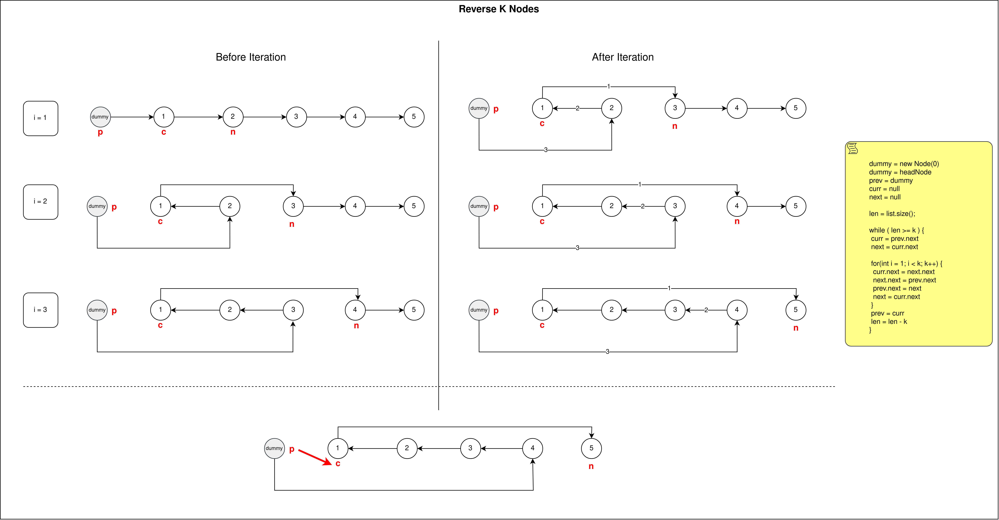

## Links
[Leetcode](https://leetcode.com/problems/reverse-nodes-in-k-group/description/)

## Expected Output
Reversed K-Groups in List


## Brute Force Approach
1. Have two pointer at head (temp & tail)
2. `tail` pointer will record k nodes into an array of size k(`kNode[]`)
3. `temp` node will update the values **k-1 to k=0** in the list
4. We have a edge case check before we update the values using `temp`. i.e.,\
    a. We check if `tail` has become null => `tail` didn't record `k` no. of nodes (it recoreded `<k` no. of nodes ), keep the nodes as it is -> no need to reverse\
    b. If `tail` has become null and it has parsed `k` no. of nodes => revese the nodes\
    c. Therefore we check `if( tail != null && i < k )`
5. T = O(n*n) , S = O(1)

## Optimized Approach

1. We use 3 Pointers to reverse the array in place in a single traversal
2. We have `prev`, `curr`, `next` pointers each does a spefic task:\
a. `curr.next` updates to `next.next`\
b. `prev.next` updates to `curr.next`\
c. `next.next` updates to  `prev.next`\
d. `prev` moves to `next`\
e. `next` moves to `curr.next`
1. `a to e` is dones `k - 1` times to reverse k-nodes in place.
2. `prev` gets updated to `curr`

**Brute force**
```
class Solution {
    public ListNode reverseKGroup(ListNode head, int k) {
        if( head == null || head.next == null) {
            return head;
        }

        ListNode temp = head;
        ListNode tail = head;
        int[] kNode = new int[k];
        int i = 0;
        while( tail != null ) {
            i = 0;

            while( tail != null && i < k ) {
                kNode[i++] = tail.val;
                tail = tail.next;
            }

            if(tail == null && i < k) {
                break;
            }

            i = k - 1;
            while ( temp != null && i >= 0) {
                temp.val = kNode[i--];
                temp = temp.next;
            }
        }

        return head;
    }
}
```

**Optimized Approach**
```
class Solution {

    private int lengthOfList(ListNode head) {
        ListNode temp = head;
        int len = 0;

        while( temp != null ) {
            len++;
            temp = temp.next;
        }

        return len;
    }

    public ListNode reverseKGroup(ListNode head, int k) {
        if( head == null || head.next == null) {
            return head;
        }

        ListNode dummy = new ListNode(0);
        dummy.next = head;
        ListNode prev = dummy;
        ListNode curr = null;
        ListNode next = null;
        int length = lengthOfList(head);


        while(length >= k) {
            curr = prev.next;
            next = curr.next;

            for(int i = 1; i < k; i++) {
                curr.next = next.next;
                next.next = prev.next;
                prev.next = next;
                next = curr.next;
            }
            prev = curr;
            length -=k;
        }

        return dummy.next;
    }
}

```


## Python

### Brute Force
```
class Solution:
    def reverseKGroup(self, head: Optional[ListNode], k: int) -> Optional[ListNode]:
        if not head or not head.next:
            return head

        cur, tail = head, head

        while tail:
            kNodes = []

            while tail and len(kNodes) < k:
                kNodes.append(tail.val)
                tail = tail.next
                
            if not tail and len(kNodes) < k:
                break

            while kNodes:
                cur.val = kNodes.pop()
                cur = cur.next
        
        return head
```

### Optimized
```
class Solution:
    def lengthOfList(self, head: Optional[ListNode]) -> int:
        cur, count = head, 0
        while cur:
            count += 1
            cur = cur.next
        return count

    def reverseKGroup(self, head: Optional[ListNode], k: int) -> Optional[ListNode]:
        dummy = ListNode(0, head)
        pre = dummy 

        # k = 4, list_length = 10, `no of times list is reversed = 2`, 10//4 = 2, the remaining two nodes are left as it is.
        reverse_times = self.lengthOfList(head) // k

        for i in range(reverse_times):
            cur, nex = pre.next, pre.next.next

            # k nodes to revese => 3 links to reverse, hence `k - 1`, we reverse 3 links
            for j in range(k - 1):
                cur.next = nex.next
                nex.next = pre.next
                pre.next = nex
                nex = cur.next
            
            pre = cur
        
        return dummy.next
```