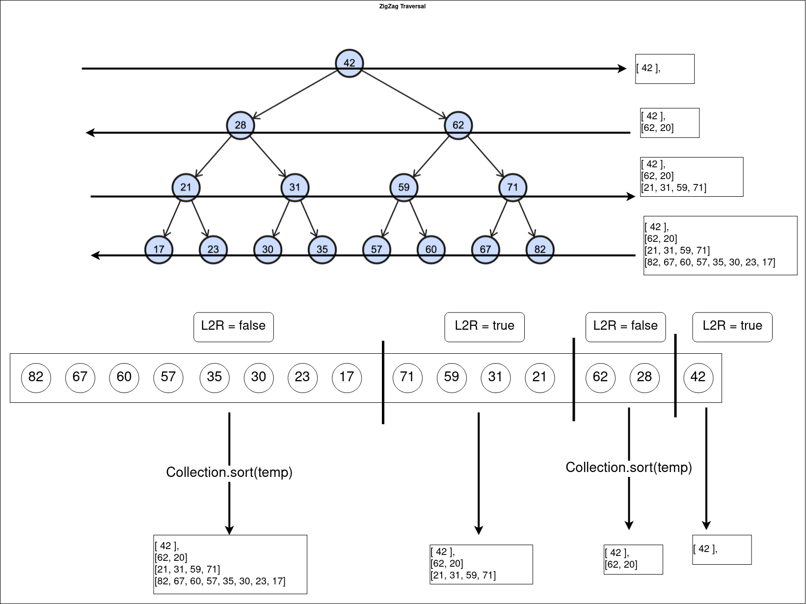

## Links
[Leetcode](https://leetcode.com/problems/binary-tree-zigzag-level-order-traversal/description/)

## Expected Output
See Examples in the problem statement

## Approach
1. Use Queue to record nodes at each level
2. Before adding the temp list to result list
   1. if l2r is true: put temp as it is
   2. if l2r is false: reverse temp & then put it in res list



**Apporach**
```
class Solution {
    public List<List<Integer>> zigzagLevelOrder(TreeNode root) {
        List<List<Integer>> res = new ArrayList();
        Queue<TreeNode> q = new LinkedList<>();

        if( root == null ) {
            return res;
        }
        
        int size = 0;
        boolean l2r = true;
        q.add(root);

        while( !q.isEmpty() ) {
            List<Integer> temp = new ArrayList<>();
            size = q.size();

            for(int i = 0; i < size; i++) {
                root = q.remove();

                if(root.left != null) {
                    q.add(root.left);
                }

                if(root.right != null) {
                    q.add(root.right);
                }

                temp.add(root.val);
            }

            if( !l2r ) {
                Collections.reverse(temp);
            }

            l2r = !l2r;
            res.add(temp);
        }

        return res;
    }
}
```

